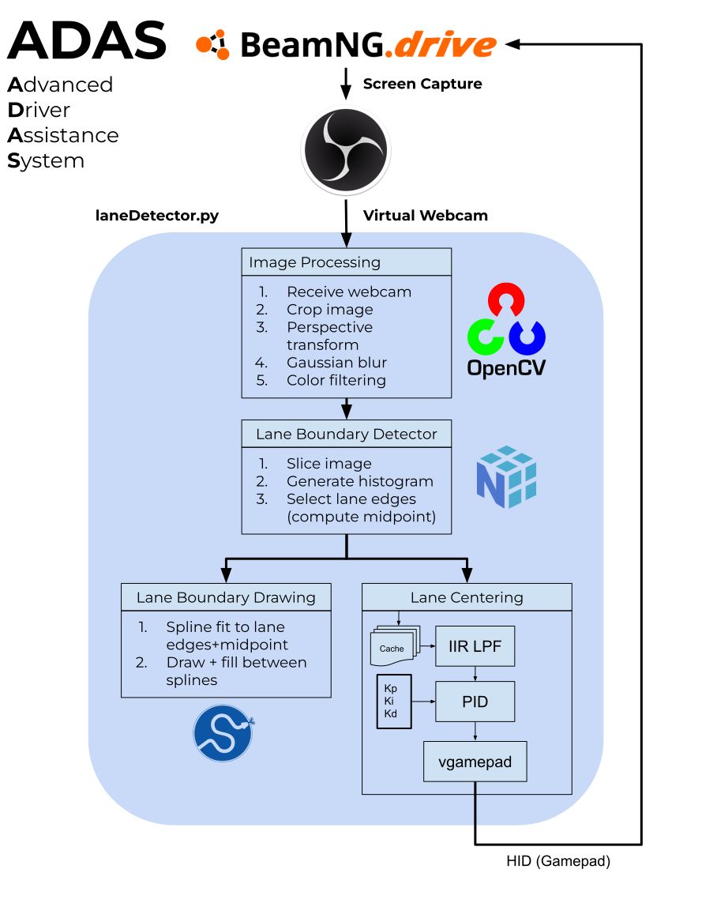

# BeamNG.Drive ADAS
### (Or, the making of a car that drives itself in a game about driving)

This project is a pretty simple OpenCV based implementation of ADAS in the game [BeamNG.drive](https://www.beamng.com/game/).

# Libaries

- [NumPy](https://numpy.org/) is great!
- And so is [SciPy](https://scipy.org/)! I use it for univariate spline fitting, as well as for the digital filters.
- [vgamepad](https://github.com/yannbouteiller/vgamepad) is the tool used for all steering commands. Works really well!
- How could I forget about the centerpiece, [OpenCV](https://opencv.org/), which I use for image capture, some manipulation tasks, drawing, and display
- I use [simple-pid](https://readthedocs.org/projects/simple-pid/) right now for my PI loop for lane centering, however I plan to switch eventually to a custom implementation because it doesn't seem to offer the option to add a loop filter onto a variable. Seeing as it is "simple", this isn't a fault, and it is a fantastic library regardless.
# References
- The wonderful code from the [Udacity Self-Driving Car Engineer Nanodegree](https://github.com/ndrplz/self-driving-car/tree/master) was a huge help in getting oriented on lane detection.
- Aly, M. (2008, June). Real time detection of lane markers in urban streets. In 2008 IEEE intelligent vehicles symposium (pp. 7-12). IEEE.
- Wang, Y., Teoh, E. K., & Shen, D. (2004). Lane detection and tracking using B-Snake. Image and Vision computing, 22(4), 269-280.
